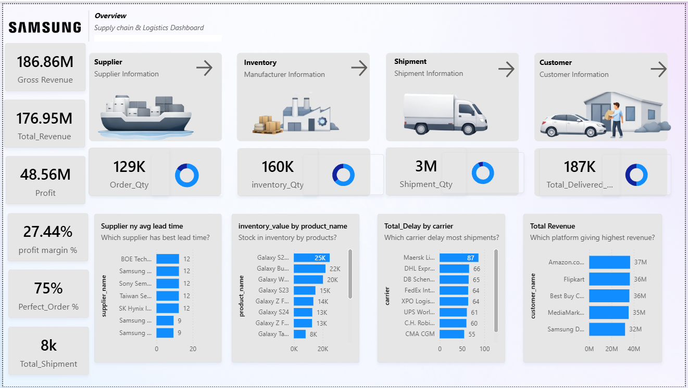

# 🚀 Samsung Supply Chain & Logistics Analytics Dashboard

## 📊 Project Overview
This Power BI project focuses on end-to-end supply chain visibility for **Samsung’s logistics operations**. In a global supply chain, monitoring supplier performance, shipment delays, and inventory levels is critical. This dashboard transforms raw operational data into actionable insights to help stakeholders identify inefficiencies and optimize the bottom line.

### 🔗 Quick Links
- **[View Dashboard Snapshot](#-dashboard-preview)**
- **[Watch Demo Video](#-video-walkthrough)**

---

## 📈 Key Business Metrics
* **Gross Revenue:** $186.86M
* **Total Profit:** $48.56M
* **Profit Margin:** 27.44%
* **Shipment Quantity:** 3M Units
* **Current Inventory:** 160K Stock

---

## 🔍 Analytical Focus Areas
The dashboard provides a deep dive into four critical supply chain pillars:

1. **Supplier Performance:** Analyzed lead times, quality scores, and unit cost trends to identify the most reliable partners.
2. **Inventory Management:** Monitored stock levels, safety stock requirements, and defective product rates to reduce holding costs.
3. **Logistics & Shipments:** Tracked shipment delays by carrier and identified bottlenecks in the distribution network.
4. **Sales Channels:** Evaluated revenue performance across Online, Retail, and Direct sales channels.

---

## 🛠️ Tech Stack & Skills
* **Power BI Desktop:** Report authoring and dashboard design.
* **Power Query:** Data cleaning, transformation, and ETL processes.
* **DAX (Data Analysis Expressions):** Created complex measures for Profit Margins, YoY Growth, and Lead Time averages.
* **Data Modeling:** Established a Star Schema to ensure optimized performance and accurate filtering.

---

## 🖼️ Dashboard Preview

---

## 🎥 Video Walkthrough
Click the link below to view the interactive features of this dashboard, including slicers, drill-throughs, and dynamic filtering.

▶️ **[Watch the Dashboard Demo (MP4)](1773646444969.mp4)**

---

## 💡 Business Outcome
By utilizing this dashboard, logistics managers can:
* **Reduce Delays:** Optimize carrier selection based on historical performance.
* **Inventory Control:** Minimize "Stock-Outs" by monitoring safety stock levels in real-time.
* **Cost Efficiency:** Improve supplier selection based on quality scores and unit cost analysis.

---
